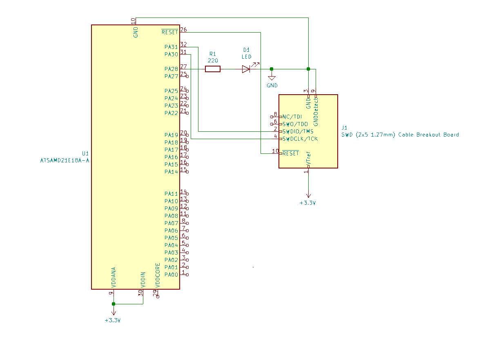
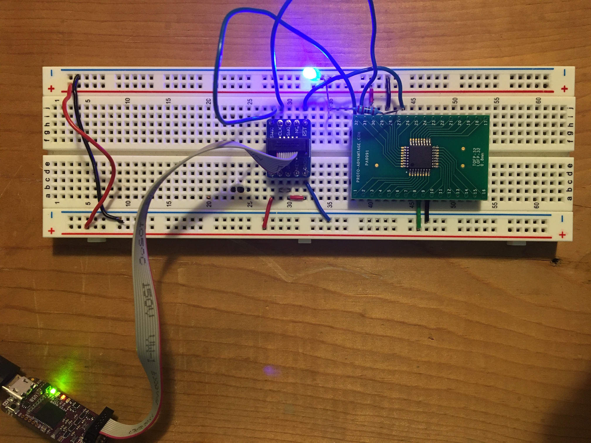

# Compiling for SAMD21 without a bootloader

### Description
---
This is a simple test program and makefile that will compile a program to blink a LED on GPIO pin 28 using a SAMD21 microcontroller.
The code is burned to the chip via SWD using a Black Magic Probe and does not include a bootloader.

### TLDR
---
To upload and run this program I used a black magic probe connected to the SAMD uC using SWD pins.
The commands to compile, burn the code, and start debugging are:

```
make
sudo arm-none-eabi-gdb TestCode.elf
(gdb) target extended-remote /dev/ttyACM0
(gdb) monitor swdp_scan
(gbd) attach 1
(gbd) load
(gbd) run
```

### To install the GNU Arm Embedded Toolchain on Ubuntu 18.04+
---

- Visit [developer.arm.com](https://developer.arm.com/tools-and-software/open-source-software/developer-tools/gnu-toolchain/gnu-rm/downloads) and download the release for your specific system. For 64 bit Ubuntu I used [this](https://developer.arm.com/-/media/Files/downloads/gnu-rm/9-2020q2/gcc-arm-none-eabi-9-2020-q2-update-x86_64-linux.tar.bz2?revision=05382cca-1721-44e1-ae19-1e7c3dc96118&la=en&hash=D7C9D18FCA2DD9F894FD9F3C3DC9228498FA281A)
- Untar this somewhere in your PATH. I used `/usr`:
```
cd /usr
wget <download_link>
sudo tar -xjf <tarfile_name> --strip-components=1
```
### Hardware Used:
---
- [ATSAMD21E18A-AU](https://www.digikey.com/en/products/detail/microchip-technology/ATSAMD21E18A-AU/4935886)
- [TQFP-32/LQFP-32 TO DIP-32 SMT](https://www.digikey.com/en/products/detail/chip-quik-inc/PA0091/5014739)
- [SWD (2x5 1.27mm) Cable Breakout Board](https://www.digikey.com/en/products/detail/adafruit-industries-llc/2743/5699184)
- [Black Magic Probe (Available on DigiKey but more expensive)](https://1bitsquared.com/products/black-magic-probe)
- Breadboard, jumper wires, a small led and resistor, and a USB Type A/USB Micro-B cable

### Sources and Useful Links:
---
- [Useful GDB Commands (Black Magic Probe)](https://github.com/blacksphere/blackmagic/wiki/Useful-GDB-commands)
- [Program an Atmel SAM without an IDE](https://www.mickmake.com/post/program-atmel-sam-without-ide-tutorial/)
- [Bare Metal Embedded Systems Linker Script File](https://microcontrollerslab.com/bare-metal-embedded-systems-linker-script-file/)
- [How to burn / flash a bootloader into an external ATSAMD21](https://www.avdweb.nl/arduino/samd21/samd21-programmer)
- [SAMD21 Datasheet](http://ww1.microchip.com/downloads/en/DeviceDoc/SAM_D21_DA1_Family_DataSheet_DS40001882F.pdf)

### Schematic
---


### Example Wiring
---

